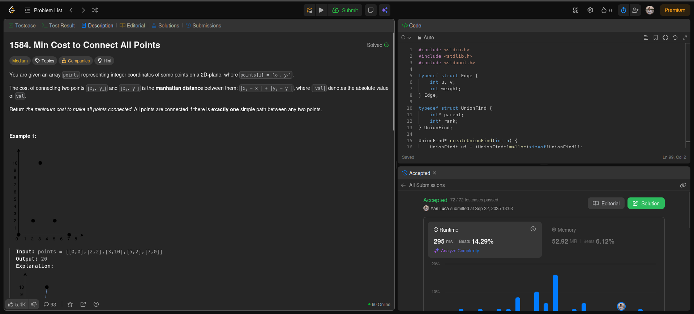
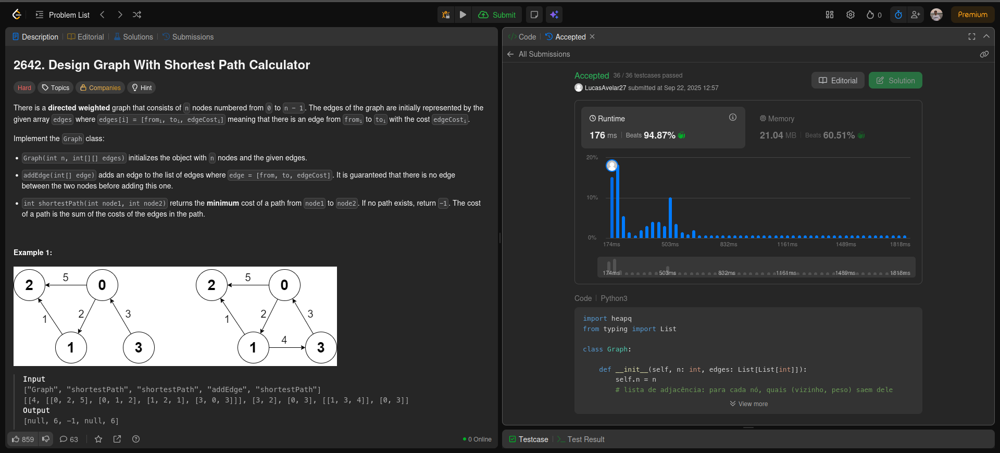
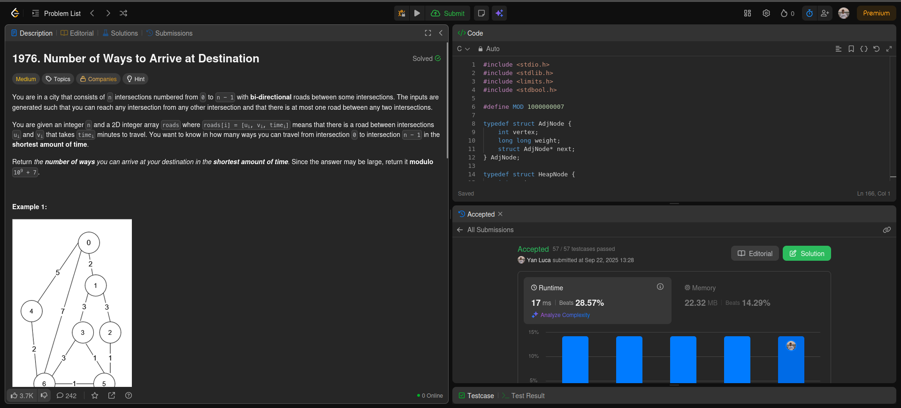
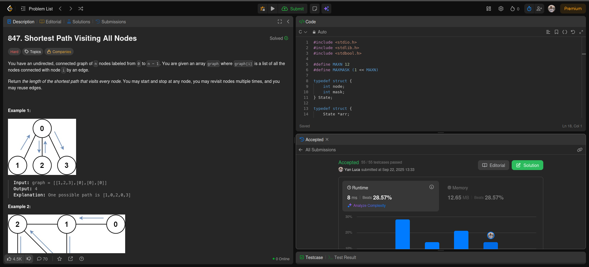

## Alunos
Lucas Antunes de Avelar - 200067095

Yan Luca Viana de Araújo Fontenele - 211031889
## Questões 

## [Min Cost to Connect All Points](https://leetcode.com/problems/min-cost-to-connect-all-points/description/)

## [Design Graph With Shortest Path Calculator](https://leetcode.com/problems/design-graph-with-shortest-path-calculator/description)

## [Number of Ways to Arrive at Destination](https://leetcode.com/problems/number-of-ways-to-arrive-at-destination/description/)

## [Shortest Path Visiting All Nodes](https://leetcode.com/problems/shortest-path-visiting-all-nodes/description/)

# Vídeo explicativo

